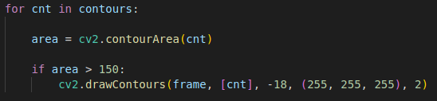
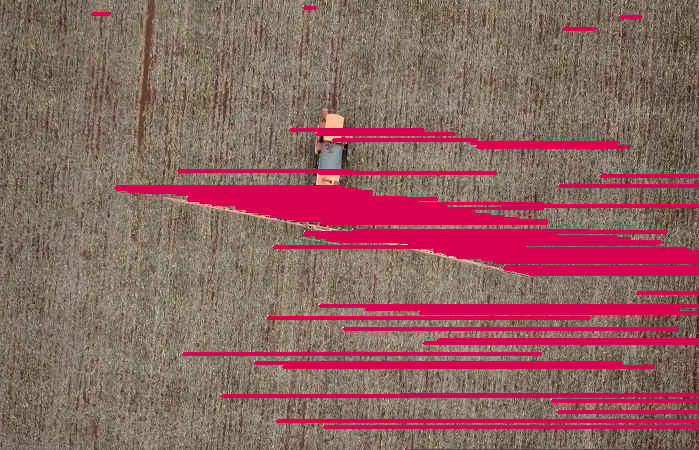
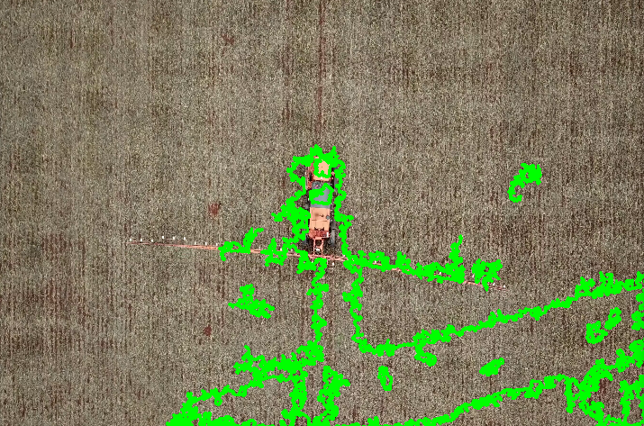
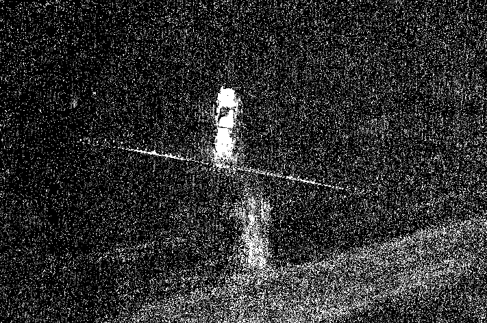
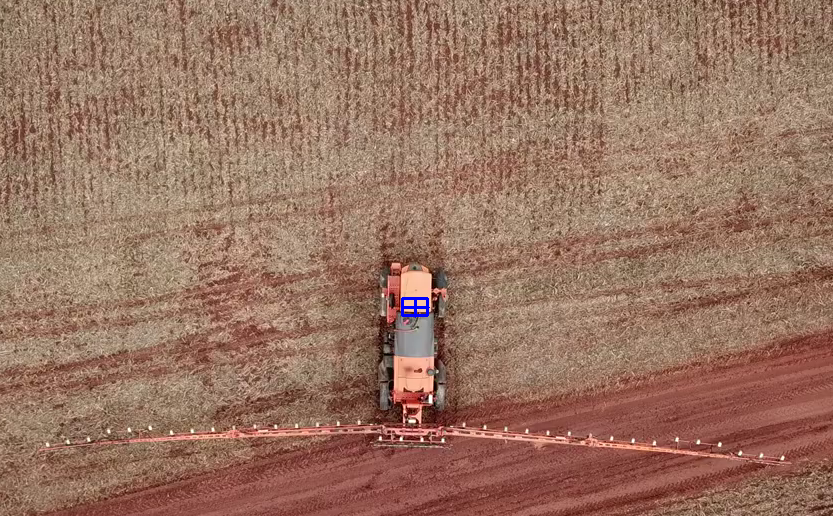

# Coleta de pontos com OpenCV

Este projeto tem como objetivo realizar a coleta de pontos em um vídeo utilizando a biblioteca OpenCV.

O projeto consiste em obter os dados dos pontos específicos em uma pulverizadora, como pode ser observado na imagem abaixo:


Deve-se identificar 5 pontos para cada frame no video e extrair os dados de X e Y de cada um deles e armazenar em um arquivo CSV. 

## Requisitos

<ul>
  <li>Python 3</li>
  <li>pip</li>
  <li>OpenCV</li>
</ul>

## Como funciona

<ul>
  <li>O usuário deverá abrir o video do qual deseja coletar os pontos.</li>
  <li>O usuário deverá marcar de qual região deseja inspecionar.</li>
  <li>Posteriormente após a execução do video, o sistema deverá exportar os pontos coletados em um arquivo de texto.</li>
</ul>

## Como testar

Primeiramente, deve-se instalar as dependências.

```
pip install opencv-python
```
Depois, deve-se então acessar a pasta raiz do projeto e executar o seguinte comando

```
python tracking.py 'seuvideo'
```
O que esse comando faz é chamar o arquivo tracking.py, passando o argumento seuvideo, por exemplo: pulverizadora.MOV

## Dificuldades Encontradas

#### Detectar pontos de forma automática

Ao tentar localizar os pontos de p1 até p5 de maneira automática, encontrei alguns obstáculos. 

#### 1.1
A primeira tentativa foi localizar os pontos através do rastreamento de uma cor pré-selecionada.



Onde passei a cor branca no formato BGR, que é o formato que a documentação do OpenCV exige, e obtive o seguinte resultado:



Como pode-se observar, existem inúmeros ruídos na imagem, o que difícultou fazer o tracking dos pontos pedidos.

####1.2

Na minha segunda tentativa, optei pela estratégia de localizar pela movimentação do objeto e da mesma forma, obtive o mesmo resultado.





####1.3 

Após as duas tentativas sem sucesso, optei por o MultiTracking, passando os pontos de maneira manual.



O algoritmo escolhido foi o CRST, que tem uma maior precisão dentre os que a biblioteca disponibiliza. Onde pude ter um resultado satisfatório, obtendo os resultados de x e y de cada ponto selecionado. 

###Formato de vÍdeo disponibilizado

Pelo fato do vídeo estar em alta resolução e com o tamanho de aproximadamente 1GB, o que ocasionava lentidão nos diversos testes que eu realizava, foi-se então necessário a conversão do mesmo para conseguir trabalhar de uma maneira mais eficiente, o formato escolhido foi o .mp4.
## Referências
  OpenCV Documentation
## Autor
Eberty Miranda